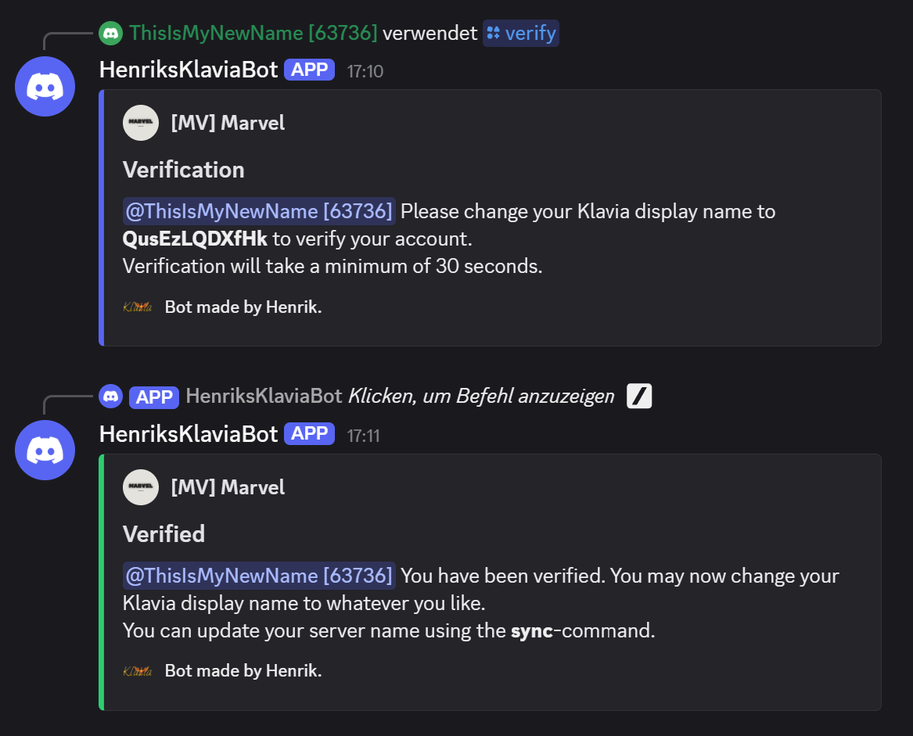
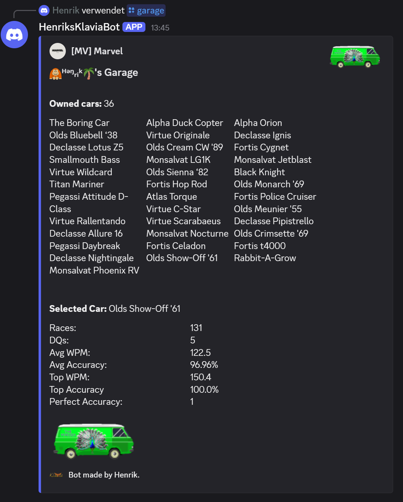
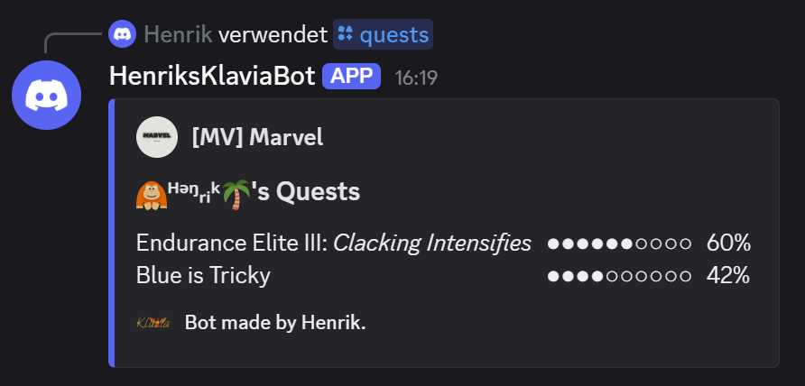

# Klaval - A Klavia bot for Discord
I got bored, so I decided to write a Discord bot for Klavia.  
Available commands, example images and short documentation can be found below.

## Features:
- Link a Klavia team to your discord server and get updates on new members, promotions, etc.
- Verify server members using their Klavia account and synchronize their server profiles automatically.
- Access Klavia profiles, stats, quests and more using commands like "/garage".
- Search for Klavia accounts using the "/find_racer" command.

## Commands:  
The following commands are currently supported:  
| Command            | Parameters            | Description |
|--------------------|-----------------------| ------------|
| /setup             |                       | Should be used immediately after adding Klaval to a server. Runs setup tasks, creates roles, sets the welcome channel, message author and icon. Most importantly it allows you to link a team to your server and configure event updates on Discord. If the welcome channel is not defined, new members will not be greeted by Klaval. If the message author is not defined, the author and icon will both not show. If no Klavia team has been linked, you will not receive any team updates. |
| /find_racer        | <klavia_name>         | Searches for Klavia account and returns id, display name and username. |
| /verify            | <klavia_name>         | Verifies account, links it to the Klavia account and updates their server profile. |
| /force_verify      | <member> <klavia_id>  | Can be used by admins to verify other users or themselves immediately. Klavia IDs can be found using /find_racer. |
| /unverify          |                       | Unverifies the user who's using the command. |
| /force_unverify    | <member>              | Can be used by admins to unverify other users or themselves immediately. |
| /sync              |                       | Synchronizes the server profile and Klavia account. Updates server profile. |
| /garage            | [klavia_name]         | Displays some information about the users garage. |
| /stats             | [klavia_name]         | Displays some statistics of the given user. |
| /quests            | [klavia_name]         | Displays the users current quests. |

<> = Required Parameter  
[ ] = Optional Parameter  

## Currently working on:
### Better performance
- improving crawler performance by using async
### Bugs & more commands  
- /shop
- /leaderboards
- /team

## Development Environment
1. Python 3.12  
   This bot has been written in Python 3.12, because unfortunately py-cord does not support 3.13, yet.
2. .env file  
   You must provide a .env file in the project root directory containing your Klavia credentials and Discord bot token.  
   Example .env file:  
    ```
    klavia_username_or_mail=<enter-your-klavia-mail-here>
    klavia_password=<enter-your-klavia-password-here>
    discord_bot_token=<enter-your-bot-token-here>
    operation_mode=<development or production>
    dev_server_id=<dev-server-id-or-nothing-if-production>
    ```
3. Discord server setup:  
   Make sure to give the bot sufficient permissions. It needs to do the following things:
   - Create, edit and assign server roles.
   - Edit user profiles.
   - Send messages.
     
   To avoid conflict with other bots, all roles have a prefix. These roles will be automatically created, once you run the setup command:
   - Klaval: Unverified
   - Klaval: Verification Pending
   - Klaval: Verified

## Examples:



